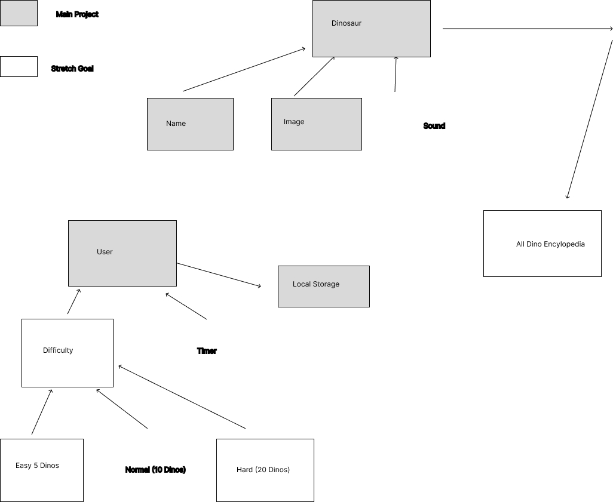

# DinoRiders
Gerald Bruno, Jeffery Flores, Wasim Soomro, ChristianRhey Tojot 

In this project we are creating a children's game that will assess their memory and knowledge of dinosaurs. We will display one page with dinosaur images and a second page where they will have to identify which dinosaurs they saw on the first page.

Link to Project Management Board that contains user stories:
https://github.com/orgs/BrooknealNet/projects/3/views/1

Dom Model

References:
Code for aboutUs.html page
https://www.w3schools.com/howto/howto_css_about_page.asp